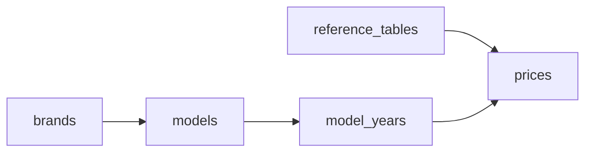

# FIPE Data Pipeline

[](https://github.com/caiopizzol/fipe-data-pipeline/releases)

Crawler em TypeScript que coleta dados históricos de preços de veículos da Tabela FIPE e armazena em PostgreSQL.

## O Problema

A FIPE publica preços de veículos todo mês desde 2001, mas:

- **Não existe API oficial** - o site é só consulta manual
- **5 níveis de hierarquia** - mês de referência → marca → modelo → ano/combustível → preço
- **Escala massiva** - 320+ tabelas de referência, 90+ marcas, milhares de modelos
- **Alternativas pagas** - existem, mas sem garantia de confiabilidade dos dados

## Features

- **Throttling adaptativo** - ajusta delay automaticamente em caso de rate limit (429)
- **Fallback hierárquico** - se um modelo falha, continua com os outros
- **Upserts idempotentes** - pode rodar de novo sem duplicar dados
- **Classificação por segmento** - categoriza modelos (SUV, Sedã, Hatch, etc.) usando Claude

## Quick Start

```bash
# Sobe o banco
docker compose up -d

# Instala dependências
pnpm install

# Aplica schema
pnpm db:push

# Crawla dados de 2025
pnpm crawl
```

## Uso

```bash
pnpm crawl                                    # Ano atual, todos os meses
pnpm crawl -- --year 2024                     # Ano específico
pnpm crawl -- --year 2020-2024                # Range de anos
pnpm crawl -- --year 2020,2022,2024           # Anos específicos
pnpm crawl -- --month 1-6                     # Range de meses
pnpm crawl -- --year 2023-2024 --month 1,6,12 # Combinar filtros
pnpm crawl -- --brand 59                      # Marca específica (59 = VW)
pnpm crawl -- --brand 59 --model 5940         # Modelo específico
pnpm crawl -- --brand 59 --model 5940,5941    # Múltiplos modelos
pnpm crawl -- --reference 328                 # Tabela de referência específica
pnpm crawl -- --classify                      # Classificar modelos novos via AI
ALLOWED_BRANDS=21,22,23 pnpm crawl            # Limitar marcas via env

pnpm status                                   # Estatísticas do banco
pnpm classify                                 # Classificar modelos sem segmento
pnpm classify -- --dry-run                    # Preview da classificação
```

## Docker

```bash
# Build
docker build -t fipe-crawler .

# Rodar container (fica idle, pronto para comandos)
docker run -d --name fipe --env-file .env fipe-crawler

# Executar crawl
docker exec fipe pnpm tsx src/index.ts crawl --brand 25 --year 2024 --month 6

# Ver ajuda
docker exec fipe pnpm tsx src/index.ts --help

# Ver status
docker exec fipe pnpm tsx src/index.ts status
```

## Arquitetura

```
src/
├── fipe/
│   ├── client.ts          # HTTP client com throttling
│   └── schemas.ts         # Validação Zod
├── crawler/
│   └── processor.ts       # Orquestração do crawl
├── db/
│   ├── schema.ts          # Drizzle ORM
│   └── repository.ts      # Upserts
└── classifier/
    └── segment-classifier.ts  # Claude API
```

## Stack

- Node.js 22 + TypeScript
- Drizzle ORM
- PostgreSQL 16
- Zod (validação runtime)

## Schema



**Exemplo:**

| reference_tables | brands     | models   | model_years | prices    |
| ---------------- | ---------- | -------- | ----------- | --------- |
| Jan/2025 (#328)  | Volkswagen | Gol 1.0  | 2020 Flex   | R$ 45.000 |
|                  |            |          | 2021 Flex   | R$ 48.000 |
|                  |            | Polo 1.6 | 2022 Flex   | R$ 72.000 |
| Fev/2025 (#329)  | Volkswagen | Gol 1.0  | 2020 Flex   | R$ 44.500 |

Cada preço vincula um veículo (modelo + ano + combustível) a um mês de referência.

Schema SQL completo em [`initial.sql`](./initial.sql).

## Dados

Fonte oficial: `veiculos.fipe.org.br`

- Tabelas de referência (snapshots mensais desde 2001)
- Marcas, modelos, anos
- Preços por tipo de combustível

## Demo

Veja os dados em ação: [fipe.chat](https://fipe.chat)

## Licença

MIT
