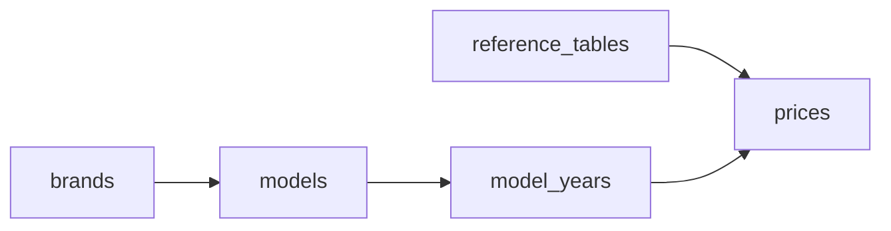

# FIPE Data Pipeline

[](https://github.com/caiopizzol/fipe-data-pipeline/releases)

O pipeline de dados por trás do [fipe.chat](https://fipe.chat). Crawler em TypeScript que coleta dados históricos de preços de veículos da Tabela FIPE e armazena em PostgreSQL.

## Quick Start

```bash
docker compose up -d    # banco
pnpm install            # dependências
pnpm db:push            # schema
pnpm crawl              # crawl
```

## Uso

```bash
pnpm crawl                                    # ano atual, todos os meses
pnpm crawl -- --year 2024                     # ano específico
pnpm crawl -- --year 2020-2024                # range de anos
pnpm crawl -- --year 2020,2022,2024           # anos específicos
pnpm crawl -- --month 1-6                     # range de meses
pnpm crawl -- --year 2023-2024 --month 1,6,12 # combinar filtros
pnpm crawl -- --brand 59                      # marca específica (59 = VW)
pnpm crawl -- --brand 21,22,59                # múltiplas marcas
pnpm crawl -- --brand 59 --model 5940         # modelo específico
pnpm crawl -- --reference 328                 # tabela de referência específica
pnpm crawl -- --classify                      # classificar modelos novos via AI
pnpm crawl -- --force                         # re-buscar tudo
ALLOWED_BRANDS=21,22,23 pnpm crawl            # limitar marcas via env

pnpm status                                   # estatísticas do banco
pnpm classify                                 # classificar modelos sem segmento
pnpm classify -- --dry-run                    # preview da classificação
```

## Docker

```bash
docker build -t fipe-crawler .
docker run -d --name fipe --env-file .env fipe-crawler

docker exec fipe pnpm tsx src/index.ts crawl --brand 25 --year 2024 --month 6
docker exec fipe pnpm tsx src/index.ts status
```

## Schema


```mermaid
flowchart LR
    reference_tables --> prices
    brands --> models --> model_years --> prices
```

Schema SQL completo em [`initial.sql`](./initial.sql).

## Fonte de Dados

- **URL**: [veiculos.fipe.org.br](https://veiculos.fipe.org.br)
- **Atualização**: Mensal (desde 2001)
