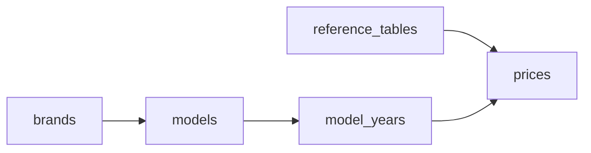

<p align="center">
  
</p>

<h1 align="center">FIPE Data Pipeline</h1>

<p align="center">
  Coleta e processa dados históricos de preços de veículos da Tabela FIPE para PostgreSQL.
  <br>
  Parte do <a href="https://fipe.chat">fipe.chat</a> — os dados que a FIPE tem, a clareza que ela nunca deu.
</p>

<p align="center">
  <a href="https://github.com/caiopizzol/fipe-data-pipeline/releases"></a>
  <a href="https://bun.sh"></a>
  <a href="https://biomejs.dev"></a>
</p>

Pipeline em Bun e TypeScript para coletar preços históricos de **carros e utilitários da categoria 1 da FIPE**, armazenar em PostgreSQL e retomar coletas interrompidas. Classificação por IA e backups são opcionais.

## Início rápido

Requisitos: **Bun 1.3.12** e **Docker**. Use `bun install` neste projeto.

```bash
cp .env.example .env
bun install --frozen-lockfile
docker compose up -d --wait
bun run db:migrate
bun run crawl -- --brand 59 --year 2024 --month 6
bun run status
```

O exemplo coleta uma marca em um mês. Sem filtros, `bun run crawl` coleta todos os meses disponíveis do ano atual. Uma coleta ampla pode demorar: as requisições respeitam o limite configurado da FIPE.

Para um banco existente, veja a [adoção das migrations](docs/operations.md#banco-existente) antes de executar `db:migrate`.

## Comandos

| Comando | Uso |
|---|---|
| `bun src/index.ts --help` | Ajuda, sem precisar configurar banco ou chaves |
| `bun run crawl` | Coletar preços e retomar pendências |
| `bun run status` | Contagens do banco |
| `bun run status -- --reference 328` | Cobertura e pendências de uma referência |
| `bun run classify` | Classificar modelos sem segmento |
| `bun run classify -- --dry-run` | Mostrar modelos, sem chamar a IA |
| `bun run backup` | Criar e enviar backup para S3/R2 |
| `bun run restore-drill` | Restaurar o backup mais recente em banco temporário |
| `bun run db:migrate` | Aplicar migrations versionadas |
| `bun run db:generate -- --name descricao` | Gerar migration após alterar o schema |
| `bun run check` | Lint, tipos, testes unitários e PostgreSQL descartável |
| `bun run docs:check` | Validar exemplos e planos do Pickled, sem chamar agentes |

## Coletas com escopo

```bash
bun run crawl -- --year 2024
bun run crawl -- --year 2020-2024
bun run crawl -- --year 2020,2022,2024
bun run crawl -- --month 1-6
bun run crawl -- --year 2023-2024 --month 1,6,12
bun run crawl -- --brand 59
bun run crawl -- --brand 21,22,59
bun run crawl -- --brand 59 --model 5940
bun run crawl -- --reference 328
bun run crawl -- --brand 59 --year 2024 --month 6 --force
bun run crawl -- --classify
```

`--model` exige `--brand`. `--reference` substitui a seleção por calendário e não pode ser combinado com `--year` ou `--month`. Os filtros valem para todas as etapas, inclusive pendências que já estavam no banco.

`--force` reinicia os checkpoints **somente do escopo selecionado** e busca novamente os dados. Se houver falha, execute o mesmo comando sem `--force` para retomar. Uma coleta com falhas termina com código diferente de zero. Uma coleta limitada a marcas ou modelos não comprova cobertura completa da referência.

## Desenvolvimento

```bash
bun run hooks:install    # instalar Lefthook neste clone
bun run check            # mesma verificação usada na CI
bun run test             # testes unitários rápidos, sem .env
bun run test:integration # PostgreSQL descartável via Docker
bun run lint
bun run lint:fix
bun run format
bun run typecheck
```

Os testes de integração criam e removem seu próprio contêiner, sem usar `DATABASE_URL`. `TEST_DATABASE_URL` pode apontar para um banco descartável cujo nome termine em `_test`; seus dados serão apagados pelos testes. `bun run db:push` fica disponível para protótipos em bancos descartáveis, mas não substitui migrations em bancos mantidos.

Arquivos usam kebab-case, funções usam camelCase, tipos usam PascalCase e testes ficam próximos ao código como `*.test.ts`. [Arquitetura e organização](docs/architecture.md) descreve as responsabilidades de cada pasta.

## Docker

Para executar o pipeline junto ao PostgreSQL local:

```bash
docker compose --profile pipeline up -d --build --wait
docker compose exec pipeline bun src/db/migrate.ts
docker compose exec pipeline bun src/index.ts crawl --brand 59 --year 2024 --month 6
docker compose exec pipeline bun src/index.ts status
```

O serviço `pipeline` usa `postgres:5432` dentro da rede do Compose. O Bun no host usa `localhost:5433`. A imagem mantém um processo ocioso para permitir comandos via `exec` e agendamento externo.

Para um banco externo acessível pelo contêiner, também é possível usar `docker build -t fipe-crawler .` e `docker run -d --name fipe --env-file .env fipe-crawler`. Ajuste `DATABASE_URL`: `localhost` dentro do contêiner se refere ao próprio contêiner. A imagem padrão usa cliente PostgreSQL 17; selecione outro major com `--build-arg POSTGRES_MAJOR=16` conforme o servidor. Compose já seleciona cliente 16.

## Configuração e operação

A referência de variáveis está em [`.env.example`](.env.example). `ANTHROPIC_API_KEY` é opcional; exigido apenas na classificação de segmentos. `FIPE_PROXY` configura um proxy opcional. Backup usa `R2_ACCESS_KEY_ID`, `R2_SECRET_ACCESS_KEY`, `R2_ENDPOINT` e `R2_BUCKET`.

A aplicação consumidora é responsável pela view materializada `latest_prices`. O pipeline funciona sem ela; `REFRESH_LATEST_PRICES=true` habilita seu refresh ao final da coleta e exige que a view e seu índice único já existam. Falhas no refresh são reportadas e podem ser tentadas novamente ao retomar a coleta.

Veja [operações](docs/operations.md) para banco existente, backup, retenção e restauração.

## Dados e schema


```mermaid
flowchart LR
    reference_tables --> prices
    brands --> models --> model_years --> prices
```

O [schema TypeScript](src/db/schema.ts) define as tabelas; [`drizzle/`](drizzle/) contém as migrations. Além das cinco tabelas de dados, `reference_brands`, `reference_models` e `reference_model_years` registram o progresso por referência.

A fonte é [veiculos.fipe.org.br](https://veiculos.fipe.org.br), com atualização mensal. A FIPE cobre carros, motos e caminhões; este pipeline consulta apenas a categoria 1. Ano da referência é o período do preço; ano-modelo identifica o veículo e pode ser `32000` para zero-quilômetro.

Licença [MIT](LICENSE).
