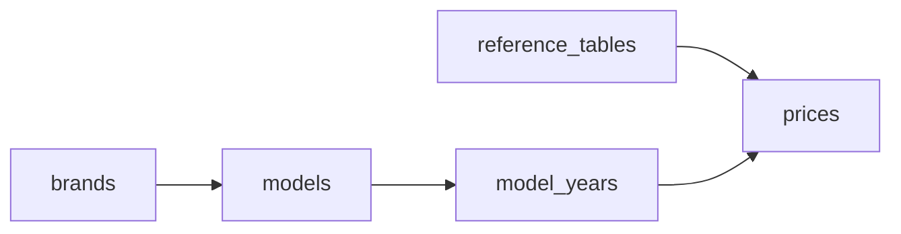

<p align="center">
  
</p>

<h1 align="center">FIPE Data Pipeline</h1>

<p align="center">
  Coleta e processa dados históricos de preços de veículos da Tabela FIPE para PostgreSQL.
  <br>
  Parte do <a href="https://fipe.chat">fipe.chat</a> — os dados que a FIPE tem, a clareza que ela nunca deu.
</p>

<p align="center">
  <a href="https://github.com/caiopizzol/fipe-data-pipeline/releases"></a>
  <a href="https://bun.sh"></a>
  <a href="https://vite.plus"></a>
</p>

## Requisitos

- [Bun 1.3.14](https://bun.sh) — executa o pipeline e instala as dependências.
- [Docker](https://docs.docker.com/get-docker/) — roda o PostgreSQL local.

`bun run test` e `bun run check` exigem Docker em execução. Os testes criam bancos
PostgreSQL 16 e 17 temporários e os removem ao terminar, sem usar seu `DATABASE_URL`. Na primeira
execução, o Docker baixa as imagens necessárias.

## Início Rápido

Para criar um banco local vazio:

```sh
cp .env.example .env
bun install --frozen-lockfile
docker compose up -d --wait
bun run db:migrate
bun run status
```

`db:migrate` cria tabelas e `latest_prices`; o banco local usa a porta 5433. Para bancos existentes,
leia [operações](docs/operations.md#banco-existente) antes de adotar as migrations.

## Via Docker

A imagem inclui os clientes PostgreSQL e AWS necessários para backup. Fora dela, instale `pg_dump`,
`pg_restore`, `psql` e `aws` para usar esses comandos.

```sh
docker build -t fipe-crawler .
docker run -d --name fipe --env-file .env fipe-crawler
docker exec fipe bun src/index.ts status
```

`DATABASE_URL` deve ser acessível pelo container; `localhost` aponta para ele mesmo.
A imagem aguarda comandos e não inicia a coleta sozinha.

## Comandos

```sh
bun install --frozen-lockfile       # instalar dependências
bun run crawl                      # coletar dados
bun run status                     # totais no banco
bun run refresh                    # coletar e publicar novos meses
bun run backup                     # salvar dump no R2/S3
bun run restore-drill              # testar a restauração
bun run check                      # formatação, lint, tipos e testes
bun run format                     # formatar com Vite+
```

Também há `bun run test`, `bun run lint` e `bun run typecheck`.

## Uso

Hoje, a coleta usa o tipo 1 da FIPE (carros). Motos e caminhões não estão incluídos.

```sh
bun run crawl                                              # ano atual
bun run crawl -- --year 2020-2024 --month 1,6,12            # período
bun run crawl -- --brand 59 --model 5940 --reference 328    # recorte específico
```

`--year` e `--month` aceitam listas e intervalos; `--brand` e `--model`, listas por vírgula.
`--model` exige `--brand`. `--reference` não pode ser combinado com ano ou mês.

A coleta retoma o progresso salvo. `--force` reinicia apenas os checkpoints do escopo selecionado e refaz a coleta.
Retome falhas sem `--force`. `status --reference 328` mostra cobertura e pendências; uma coleta
limitada a marcas ou modelos não comprova cobertura completa.

### Publicar novos meses

```sh
bun src/index.ts refresh
bun src/index.ts refresh --backup   # também faz backup; exige configuração R2
```

`crawl` salva dados, mas não publica um novo mês. O site lê `latest_prices`, que só usa referências
com `published_at` preenchido.

`refresh` processa os novos meses em ordem. Publica quando não há checkpoints pendentes e a
contagem de preços chega a 90% do mês publicado anterior. O primeiro mês não tem esse mínimo.
Isso não garante que todos os veículos foram coletados.

Falhas na coleta ou validação retornam código 1 sem publicar o mês. A próxima execução retoma
o trabalho, incluindo a view e backups pendentes (`--backup`). Outro refresh ativo causa uma saída
com código 0. Cada coleta do refresh também usa a trava de crawl, que rejeita coletas sobrepostas.

### Atualizações recorrentes

Use cron ou o agendador do seu ambiente para executar `bun src/index.ts refresh` na raiz do projeto,
com as variáveis de ambiente configuradas. Adicione `--backup` se usar R2/S3.

A coleta pode levar horas. Configure o tempo limite do job para permitir sua conclusão e acompanhe
os logs. Execuções sobrepostas de `refresh` são ignoradas enquanto outra estiver ativa.

Para monitorar o job, configure `HC_REFRESH_URL`: ele envia `/start` ao começar, a URL base no
sucesso e `/fail` na falha. Uma execução ignorada não envia ping. Falhas no monitoramento não
interrompem a coleta. Ajuste a tolerância do alerta para coletas longas (pelo menos 36 horas).

### Backup e restauração

O backup mantém 14 dumps diários e 12 mensais, em `daily/` e `monthly/`. O restore drill cria
um banco temporário com nome único, restaura o dump, verifica se há preços e remove o banco.
Falhas na limpeza são reportadas.

## Configuração

Defina as variáveis no `.env`. Só `DATABASE_URL` é obrigatória para a coleta.

| Variável                                                               | Uso                                                                                   |
| ---------------------------------------------------------------------- | ------------------------------------------------------------------------------------- |
| `DATABASE_URL`                                                         | Conexão PostgreSQL.                                                                   |
| `RATE_LIMIT_MS`, `MAX_THROTTLE_MS`, `MAX_RETRIES`                      | Intervalo inicial, limite após throttling e tentativas. Padrões: `800`, `5000` e `3`. |
| `FIPE_PROXY`                                                           | URL de proxy opcional para a FIPE. Omita se não usar.                                 |
| `HC_REFRESH_URL`                                                       | URL opcional do Healthchecks para o refresh.                                          |
| `R2_ACCESS_KEY_ID`, `R2_SECRET_ACCESS_KEY`, `R2_ENDPOINT`, `R2_BUCKET` | Configure todas para backup e restore drill em storage compatível com S3.             |

## Schema


```mermaid
flowchart LR
    reference_tables --> prices
    brands --> models --> model_years --> prices
```

Tabelas em [`src/db/schema.ts`](src/db/schema.ts); migrations versionadas em [`drizzle/`](drizzle/).
Use `bun run db:generate -- --name descricao` para gerar uma migration e revise o SQL.

Veja [arquitetura](docs/architecture.md) para estrutura de pastas e convenções de nomes,
e [operações](docs/operations.md) para migrations, Docker, retomada e backup.

Os hooks do Vite+ são instalados por `bun install`. `bun run check` é a verificação compartilhada
com a CI: formatação, lint, tipos e testes com PostgreSQL descartável. Testes unitários ficam
próximos ao código; cenários com banco real ficam em `tests/integration/`.

`bun run classify -- --dry-run` mostra modelos sem segmento sem exigir chave de IA.
`classify` e `crawl --classify` exigem `ANTHROPIC_API_KEY`.

Licença [MIT](LICENSE).

## Fonte de Dados

Estes dados são **públicos e oficiais**, disponibilizados pela Fundação Instituto de Pesquisas Econômicas (FIPE).

|                       |                                                                        |
| --------------------- | ---------------------------------------------------------------------- |
| **Fonte**             | [veiculos.fipe.org.br](https://veiculos.fipe.org.br)                   |
| **Atualização**       | Mensal (desde 2001)                                                    |
| **Cobertura da FIPE** | Carros, motos, caminhões e utilitários                                 |
| **Uso**               | Referência para seguros, financiamentos, IPVA e negociação de veículos |

Este pipeline coleta apenas carros (tipo 1 da FIPE).

A Tabela FIPE é a referência de preço médio de veículos mais utilizada no Brasil. Os dados são coletados mensalmente junto a concessionárias, revendedoras e fabricantes em todo o país.

## Contribuidores

<a href="https://github.com/caiopizzol"></a>
